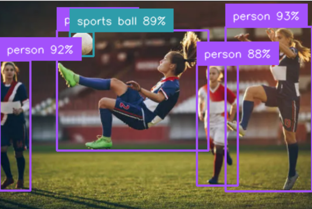

**COPA FUTBOT 2026: CENTRO X META**

Detección de objetos, mapas de calor y seguimiento en tiempo real para fútbol robótico (FMR).

---

## 📺 Demostración 
[Video en instagram](###)

---

## 🚀 Características Clave
* **Clases:** Modelo optimizado para 3 clases esenciales (`ball`, `goal`, `robot`).
* **Procesamiento:** Dataset estandarizado a $640 \times 640$.
* **Métricas de Tracking:** Generación de mapas de calor distribuidos y trazos de movimiento.

## 📊 Resultados del Entrenamiento

| Métrica | Valor |
| :--- | :--- |
| Épocas | --- |
| Tamaño de Imagen | 640x640 |
| Dataset Total | +2000 imágenes |

---

## 🛠️ Instalación y Uso

1. Clonar el repositorio:
\`\`\`bash
git clone https://github.com/tu_usuario/futbot-tracking.git
\`\`\`

2. Instalar dependencias:
\`\`\`bash
pip install ultralytics supervision opencv-python
\`\`\`

3. Correr la inferencia:
\`\`\`bash
python app.py
\`\`\`

